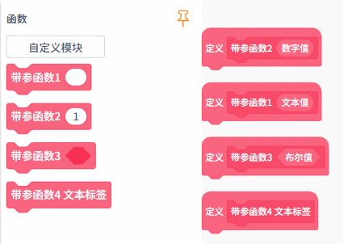

 函数积木用于封装可重复使用的程序逻辑，能够让程序结构更加清晰、易于维护。自定义函数主要分为两类：无参函数、带参函数。

| **函数类型** | **积木指令**                                                 | **说明**                                                     |
| ------------ | ------------------------------------------------------------ | ------------------------------------------------------------ |
| 无参函数     |  | 不接受任何参数返回，封装固定逻辑，可在程序中多次调用，提高代码复用性。 |
| 带参函数     |  | 可以接受参数返回，根据返回的参数进行逻辑处理，参数类型可为文本值、数字值、布尔值或文本标签。通过传入不同参数，可以让同一个函数执行不同的操作，提高程序的灵活性。 |