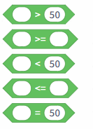
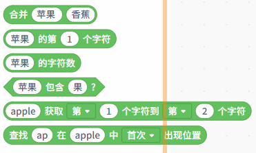
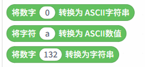

运算符类积木主要用于 数学计算、条件比较、逻辑判断和文本处理，为程序的控制流程与数据分析提供必要的运算支持。

在实时模式中，所有运算符指令已有详细介绍，这里不再逐一讲解。根据功能，运算符积木可分为以下7大类：

| **运算符类型** | **积木指令**                                                 | **说明**                                                     |
| -------------- | ------------------------------------------------------------ | ------------------------------------------------------------ |
| 算术运算       |  | 加减乘除、求余、四舍五入及高级数学运算（如绝对值、取整、平方根等）。 |
| 随机数运算     |  | 在指定范围内生成随机数。                                     |
| 比较运算       |  | 大于、大于等于、小于、小于等于、等于等条件判断。             |
| 逻辑运算       |  | 逻辑与、逻辑或、逻辑非，用于组合或反转条件。                 |
| 字符串处理     |  | 合并字符串、截取字符、获取长度、查找字符等。                 |
| 数据类型转换   |  | 实现字符串、数字、字符和 ASCII 之间的互转 。                 |
| 数值映射与约束 |  | 将数值映射到新范围或限制在最大最小值之间。                   |