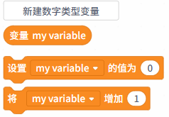
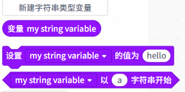
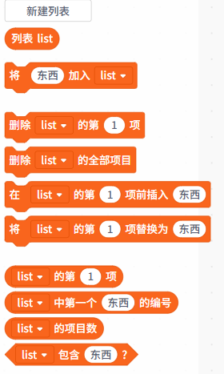

变量积木用于存储和操作数据，在程序中记录信息、传递数据或控制逻辑。在上传模式下，变量按数据类型可分为三类：数字类型、字符串类型、列表类型。

| **变量类型** | **积木指令**                                                 | **说明**                                                     |
| ------------ | ------------------------------------------------------------ | ------------------------------------------------------------ |
| 数字类型     |  | 存储整数或小数，可用于数学计算、计数或逻辑判断。             |
| 字符串类型   |  | 存储文本内容，可与字符串处理运算符配合使用。                 |
| 列表类型     |  | 存储一组数据（数字或字符串），支持批量操作、遍历和索引访问。 |