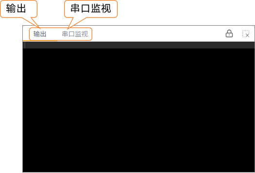
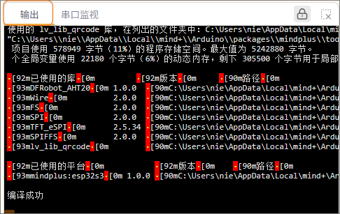
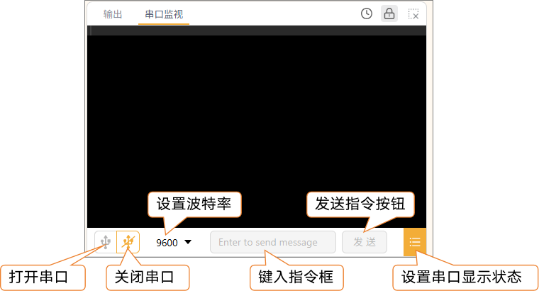

串口监视器是用来查看程序运行信息的重要工具，主要包含以下两个功能：输出、串口监视。

#### 1. 输出

用于显示程序在“编译”和“上传”过程中的系统提示信息，例如编译是否成功、上传进度是否正常等，便于用户快速判断程序是否顺利烧录到主控板。  

#### 2. 串口监视

用于查看主控板在程序运行过程中通过串口发送的数据。用户可以通过在程序中加入串口打印指令，将变量值、传感器数据或运行状态输出到该窗口，实现程序调试与数据观察。  

