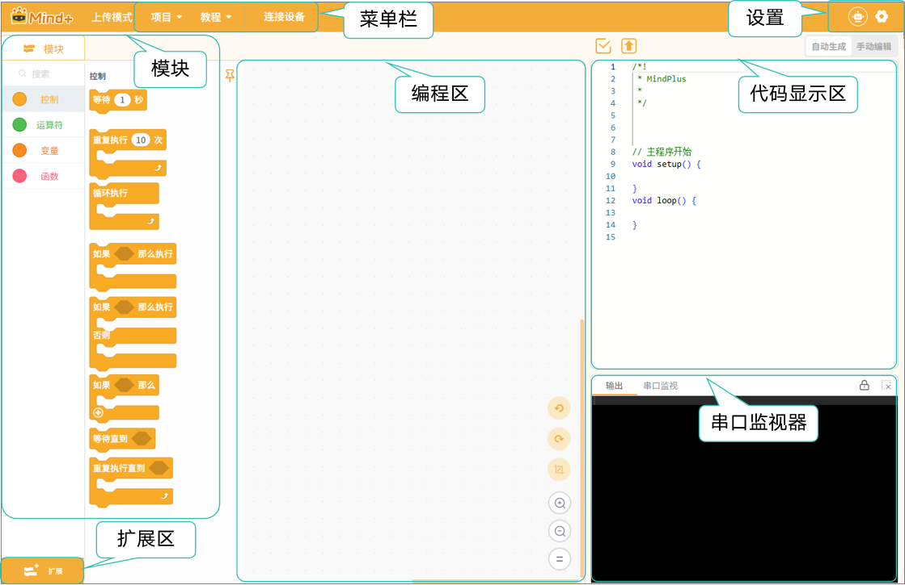
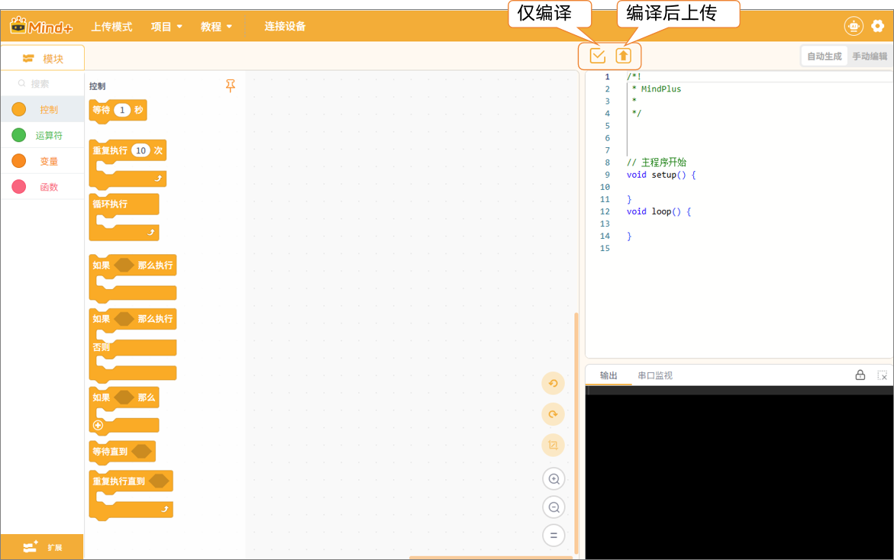

# 3.2 上传模式
上传模式是直接将程序写入硬件设备（如：micro:bit、行空板K10、Arduino Uno等主控设备）的工作模式。在该模式下，程序不在依赖实时运行，而是存储在硬件中，设备可以独立运行，即使断开设备与电脑的连接，也能继续运行程序。

**特点：**

**程序独立运行：** 上传后的程序储存在硬件内部，设备可脱机执行。  

**无需实时连接：** 无需持续连接电脑即可运行，适合展示或长期运行的项目。  

**使用多种硬件：** 支持 micro:bit、行空板K10、Arduino Uno等多种设备。  

**代码执行效率高：** 上传模式下程序直接在设备上运行，响应更快。  

### 界面认识

进入上传模式后，你将看到如下界面。

整个界面可分为7个区域：菜单栏、设置、模块、扩展区、编程区、代码显示区、串口监视器。

每个区域的详细功能介绍，可点击跳转

| [菜单栏](MenuBar.md) | [设置](Settings.md)       | [功能区-模块](FunctioModule/index.md) | [扩展区](Expansion.md) |
| ------ | ---------- | ----------- | ------ |
| [**编程区**](Programming.md) | [**代码显示区**](CodeDisplay.md) | [**串口监视器**](SerialMonitor.md)  |        |

在认识上传界面之前，我们需要先了解两个非常重要的按钮——**“仅编译”** 和 **“编译后上传”**。它们位于代码显示区的左上角，用于控制程序的编译与上传流程，是程序执行前的关键步骤。  

| **按钮名称**   | **功能说明**                                                 | **适用场景**                                               |
| -------------- | ------------------------------------------------------------ | ---------------------------------------------------------- |
| **仅编译**     | 将程序代码进行语法检查并生成可执行文件，但不会上传到主控板。 | 用于检查程序是否正确、是否能通过编译，方便调试和修改代码。 |
| **编译后上传** | 在完成编译验证后，自动将生成的可执行程序上传到主控板中运行。 | 程序确认无误后，将代码烧录到设备中，实现离线执行。         |