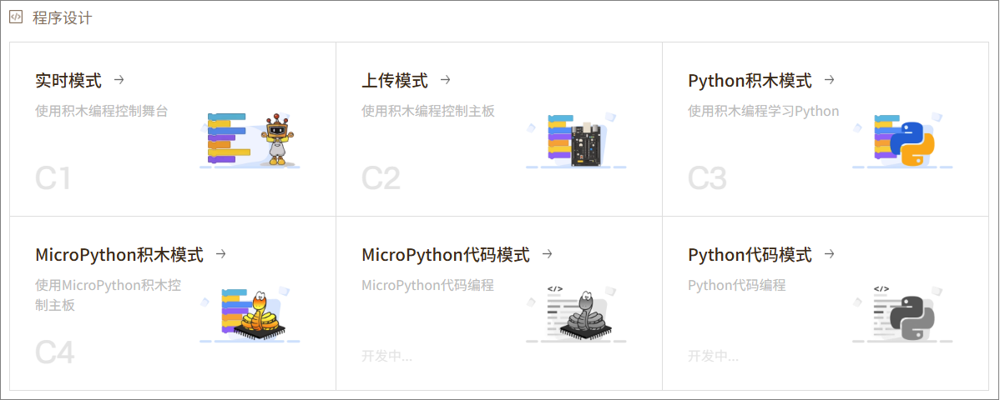

# 3.程序设计
“程序设计”是Mind+的核心工作区，是进行逻辑编程与硬件控制的起点。
为了满足不同阶段学习者的需求以及多样化的硬件应用场景，Mind+提供了6种编程模式。这些编程模式兼顾 了图形化编程与代码编程，帮助用户从入门到进阶，循序渐进地掌握编程思维与硬件控制的核心技能。  

各种编程模式的功能与特点如下：

| **编程模式**        | **功能特点**                                                 | **适用人群**                                                 |
| ------------------- | ------------------------------------------------------------ | ------------------------------------------------------------ |
| 实时模式            | 通过积木编程实时控制舞台角色或硬件设备的行为。程序在电脑上运行，指令即时传输到硬件，实现交互式控制。 | 没有编程基础且不想依赖硬件学习编程的初学者，适合制作交互项目和快速验证创意想法的用户。 |
| 上传模式            | 通过积木编程实时控制舞台角色或硬件设备的行为。程序在电脑上运行，指令即时传输到硬件，实现交互式控制。 | 想对多种硬件模块进行编程，完成后希望程序脱离电脑独立运行的用户，适合中级学习者或创客项目实践者。 |
| Python积木模式      | 以积木形式学习Python编程逻辑，兼具可视化与代码展示双重优势。编写的程序可在电脑或行空板M10上直接运行。 | 想入门Python编程并理解编程逻辑的初学者，适合从图形化编程过渡到代码学习的用户。 |
| Micropython积木模式 | 采用 MicroPython 积木方式进行编程，可控制支持MicroPython的硬件主板（如 行空板 K10、掌控板、micro:bit 等），让学生在图形化环境中学习嵌入式编程。 | 对硬件控制有兴趣，想在图形化环境中学习嵌入式编程的初中级用户或教育场景学生。 |
| MicroPython代码模式 | 完全以代码形式编写MicroPython程序，适用于需要更灵活控制或深入学习硬件编程的用户。 | 有一定编程基础，想深入掌握嵌入式硬件控制和MicroPython开发的进阶学习者。 |
| Python代码模式      | 完全使用代码方式编写 Python 程序，适用于在电脑或行空板M10上进行通用 Python 开发与进阶学习。 | 具备基础编程能力，想进行通用Python开发或高级项目开发的用户，适合进一步提升编程能力和算法水平。 |