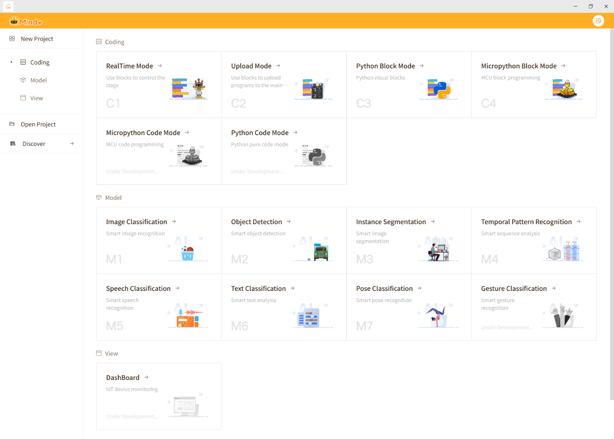

After completing the installation and launching Mind+, you will see the main interface as follows:

In the right area of the main interface, there are mainly three functional modules: **Program Design, Model Training**, and **Interface Design**. They are respectively used for program writing, artificial intelligence training, and interactive interface design.

| Program Design | The core programming area of Mind+ | In this function, you can write programs to control microcontrollers, sensors, and actuators through visual block programming or code programming. It supports multiple microcontrollers (such as: microbit, UNIHIKER K10&M10, Arduino, etc.), allowing you to easily implement creative projects from simple control to complex interaction. |
| -------------- | ----------------------------------- | ------------------------------------------------------------ |
| Model Training | AI learning and training platform of Mind+ | In this function, you can collect data, annotate samples, and train your own AI models to achieve intelligent functions such as image recognition, sound recognition, and time series pattern recognition. Trained models can also be linked with the program design module, giving works the ability to "recognize", "judge", and "learn". |
| Interface Design | Area for creating interactive interfaces | In this function, you can design controls such as buttons, text boxes, images, and gauges to implement human-computer interaction or data display functions. It is commonly used to create smart control panels, visual monitoring interfaces, or creative interactive works. |