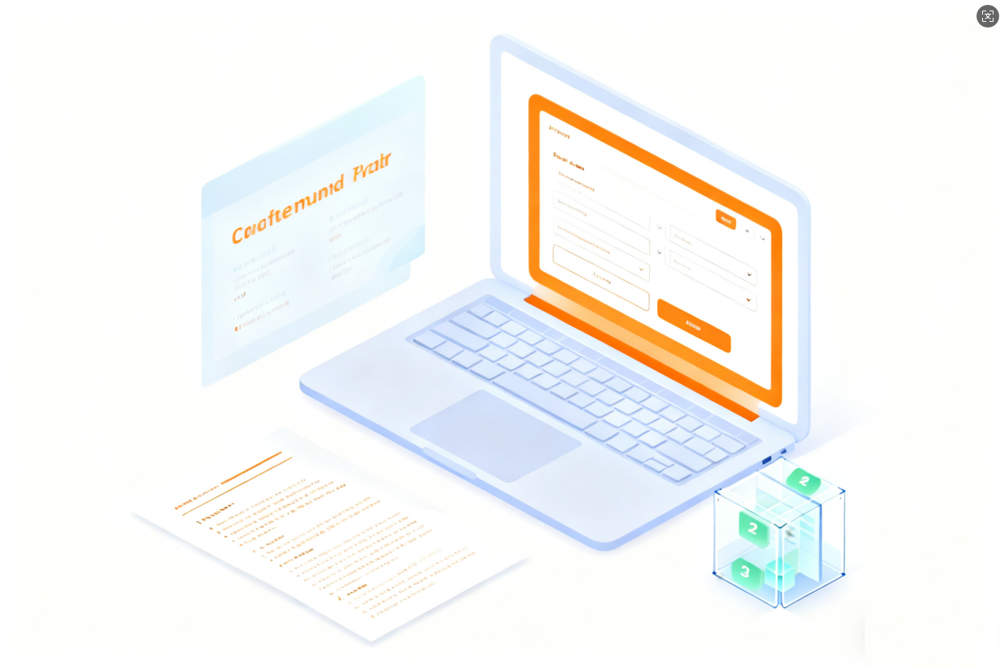
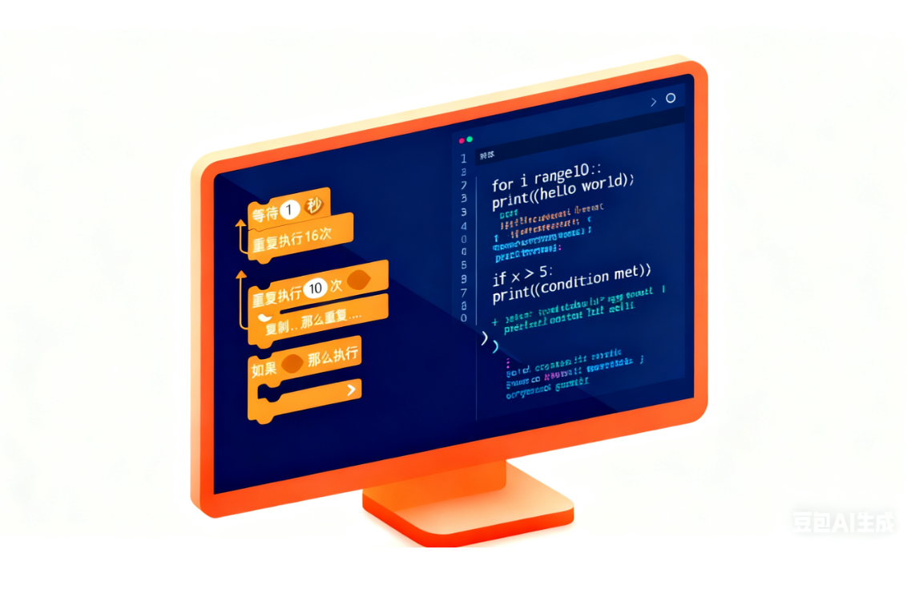
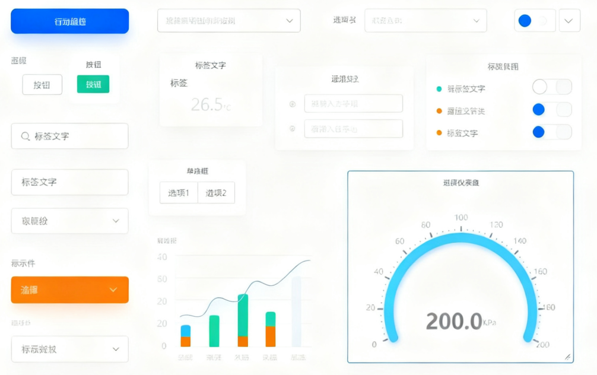

# Mind+ V2 Official Tutorial

Welcome to the Mind+ V2 Official Tutorial! Mind+ is a visual programming software designed for programming education, supporting multiple programming modes to make programming learning easier and more interesting.

This tutorial is for Mind+ V2. If you are using Mind+ V1.x, please [click here](https://mindplus.dfrobot.com/) for the relevant tutorial.

- :material-rocket-launch: &nbsp; __[Quick Start][quick-start]__  
    Essential for beginners, get started quickly
  &nbsp;__[{width=300, style="display:block;margin: 0 auto"}][quick-start]__
  __&nbsp;[User Guide][guide] |&nbsp; [User Tutorial][tutorial]__

- :material-cog: &nbsp; __[General Functions][general-function]__  
    Software introduction and installation guide
  &nbsp;__[{width=265, style="display:block;margin: 0 auto"}][general-function]__
  __&nbsp;[Mind+ Introduction][intro] |&nbsp; [Software Installation][install]__

<!-- - :material-code-braces: &nbsp; __[Coding][programming]__  
    Multiple programming modes to meet different needs
  &nbsp;__[{width=300, style="display:block;margin: 0 auto"}][programming]__
  __&nbsp;[Real-time Mode][realtime] |&nbsp; [Upload Mode][upload] |&nbsp; [Python Blocks][python-block] |&nbsp; [MicroPython Blocks][micropython-block]__ -->

- :material-brain: &nbsp; __[Model][ai-tools]__  
    Artificial intelligence tools and model training
  &nbsp;__[{width=300, style="display:block;margin: 0 auto"}][ai-tools]__
  __&nbsp;[Basic Description][ai-basic] |&nbsp; [Detailed Description][ai-detailed]__

- :material-palette: &nbsp; __[View][view-design]__  
    Visual interface design tools
  &nbsp;__[{width=300, style="display:block;margin: 0 auto"}][view-design]__
  __&nbsp;[Data Visualization Dashboard][dashboard]__

<!-- - :material-puzzle: &nbsp; __[Extensions][extensions]__  
    Rich extension functions
  &nbsp;__[{width=300, style="display:block;margin: 0 auto"}][extensions]__
  __&nbsp;[Extension Functions][ext-func] |&nbsp; [Extension Development][ext-dev]__ -->

[quick-start]: GettingStarted/UserGuide.md
[general-function]: SoftwareIntroduction/Introduction.md
[programming]: ProgrammingModes/RealTimeMode/index.md
[ai-tools]: AITools/Basic_description/introduction/introduction.md
[view-design]: ViewDesign/DashBoard/index.md
[extensions]: Extensions/index.md

[guide]: GettingStarted/UserGuide.md
[tutorial]: GettingStarted/UserTutorial.md

[intro]: SoftwareIntroduction/Introduction.md
[install]: SoftwareIntroduction/Windows.md

[realtime]: ProgrammingModes/RealTimeMode/index.md
[upload]: ProgrammingModes/UploadMode/index.md
[python-block]: ProgrammingModes/PythonBlockMode/index.md
[micropython-block]: ProgrammingModes/MicroPythonBlockMode/index.md

[ai-basic]: AITools/Basic_description/introduction/introduction.md
[ai-detailed]: AITools/Detailed_explanation/image_classification/quick_experience/quick-experience.md

[dashboard]: ViewDesign/DashBoard/index.md

[ext-func]: Extensions/index.md
[ext-dev]: Extensions/development/structure.md

